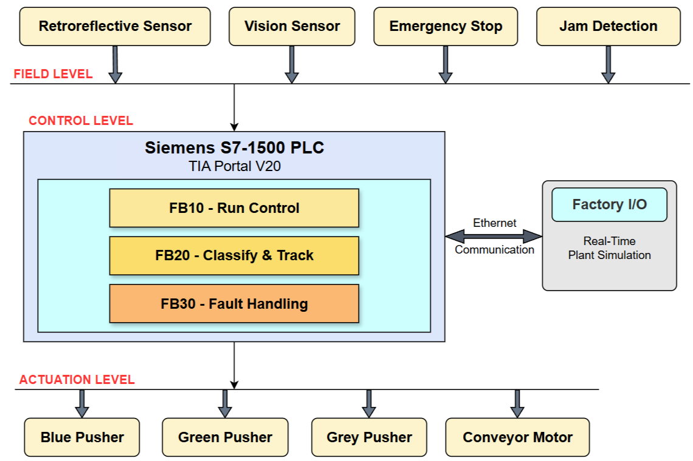

# PLC-Based Multi-Slot Conveyor Sorting System (Siemens S7-1500)

Deterministic multi-slot conveyor sorting system implemented in **TIA Portal V20** using a **Siemens S7-1500**.  
The system architecture is modular (Run Control, Tracking, Fault Handling) and validated using **PLCSIM Advanced** and **Factory I/O**.

---

## System Overview

This project implements a scan-cycle deterministic material sorting system  
based on a structured function block architecture.

The system demonstrates:

- Sequential slot allocation (1–6 circular buffer)
- Parallel part tracking using independent TON timers
- Deterministic ejection control with interlock protection
- Fault supervision (E-stop latch + jam timeout monitoring)

---

## Technologies Used

- Siemens S7-1500 (CPU 1511-1 PN)
- TIA Portal V20
- PLCSIM Advanced
- Factory I/O
- Ladder Logic (LAD)

---

## Validation Environment

- Real-time simulation using PLCSIM Advanced  
- Plant model implemented in Factory I/O  
- Ethernet communication between PLC and simulation  
- Deterministic cycle-time behavior verified under fault and load scenarios  

---

## Key Features

- 6-slot circular buffer with strict sequential allocation
- Parallel tracking with independent TON travel timers
- Scan-cycle-safe part detection using R_TRIG
- Level-based arrival logic to prevent missed triggers
- Interlocked ejection logic (single actuator arbitration)
- Integrated fault handling:
  - Emergency stop latch
  - Jam detection via TON timeout
  - Controlled system reset logic

---

## Architecture

The control system is divided into three modular function blocks:

- **FB10 – Run Control**  
- **FB20 – Classify & Track**  
- **FB30 – Fault Handling**

Each block is independently structured and called cyclically in OB1.

---

## Demonstration Video

▶ [Watch Demonstration Video](https://drive.google.com/file/d/1HU6-Vfn49sBpoio31Q82Tqrq3gHUZriI/view?usp=drive_link)

---

## Technical Report

📄 [Full Technical Report (PDF)](Report/TIA_Portal_Report.pdf)

The report includes:
- System architecture explanation
- Detailed ladder logic breakdown
- Slot allocation methodology
- Travel timing computation
- Fault detection design
- Reset handling logic
- Validation results

---

## Project Structure

- Report/ → Detailed technical documentation (PDF)
- Screenshots/ → Communication setup and Factory I/O plant setup
- Architecture/ → System architecture diagram
- Logic_Documentation/ → Printed OB/FB documentation (TIA export)
- Video/ → Demonstration video reference

---

## Engineering Highlights

- Structured modular PLC design (OB + FB architecture)
- Deterministic state handling (no scan-cycle race conditions)
- Circular buffer implementation using indexed slot arrays
- Edge-detection driven event logic (R_TRIG / F_TRIG)
- Controlled actuator arbitration (single active ejection enforcement)
- Clean reset strategy ensuring full system state consistency

---

## PLC Logic Documentation

- **OB1** – Main program cycle  
- **FB10** – Run control & safety interlocks  
- **FB20** – Multi-slot tracking & circular buffer implementation  
- **FB30** – Fault supervision and recovery logic  

See folder: `Logic_Documentation/`

---

## Application Relevance

This project demonstrates structured PLC programming, deterministic event handling,  
and modular automation design principles relevant for:

- Industrial automation systems  
- Production and material handling environments  
- Commissioning and plant validation scenarios  
- SPS-based control architecture development  

---
